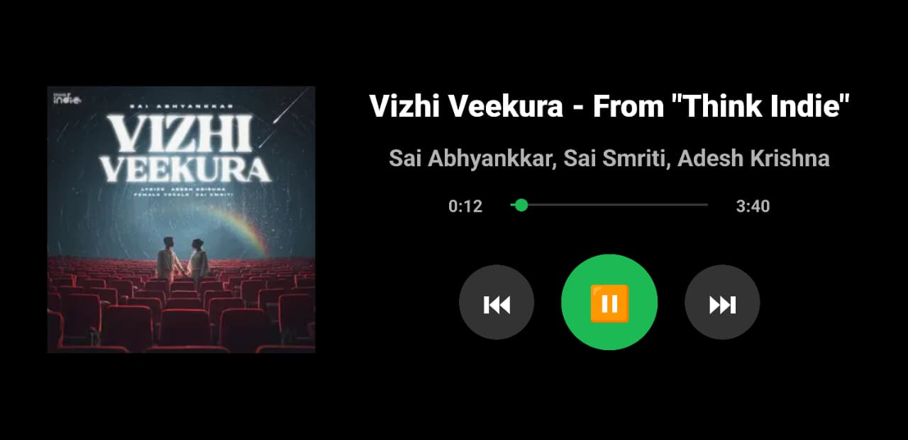

# 🎵 Spotify Mini Player (Desktop-Friendly Android App)

A lightweight **Spotify Mini Player** built using **Android Studio (Java)**, designed for **desktop usage** via direct APK installation.  
The app focuses on a minimal interface with essential playback controls and **low power consumption**, especially optimized for **AMOLED displays** using a pure black theme.

---

## 📌 Features

- ▶️ **Play / Pause**
- ⏭ **Next Track**
- ⏮ **Previous Track**
- ⏱ **Seek Bar** for playback control
- 🖥 **Desktop-friendly compact UI**
- ⚫ **Pure black UI** for reduced power usage on AMOLED screens

---

## 📦 How to Use (APK Installation)

This application is provided as a **ready-to-use APK** in the **GitHub Releases** section.

### Steps:
1. Navigate to the **Releases** section of this repository
2. Download the latest **`Spotify-Mini-Player.apk`**
3. Install the APK on your system
4. Launch the app and start controlling Spotify playback

> ✅ No Android Emulator required

---

## 🔋 Power Efficient Design

- Uses a **100% black background**
- Optimized for **AMOLED / OLED displays**
- Reduces battery consumption and eye strain

---

## 🛠 Tech Stack

- **Android Studio**
- **Java**
- **Android Media Playback APIs**
- **Material Design Components**

---

## 📸 Screenshot

> Spotify Mini Player UI preview:

---

## 📈 Use Cases

- Quick music control while working on desktop
- Minimal distraction music player
- Power-efficient music controller for OLED screens

---

## 🔮 Future Enhancements

- Volume control
- Playlist support
- Floating mini-player mode
- Keyboard shortcut support

---

## 👤 Author

**SR Viknesh**  
Android & Application Developer  
IEEE Author | Vibe Coder  

---

⭐ If you find this project useful, consider starring the repository!
